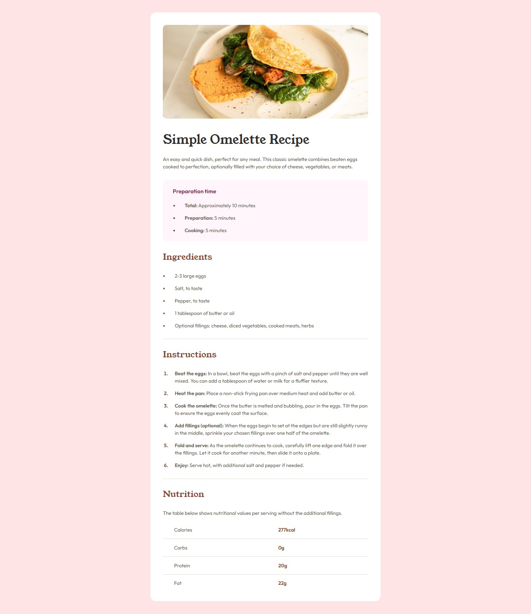
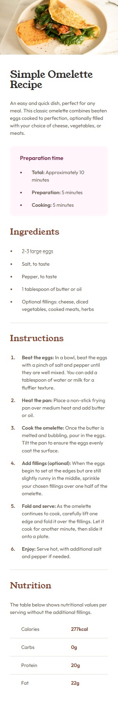

# Recipe page solution

This is a solution to the Recipe page challenge on Frontend Mentor.
## Overview

### The challenge

Users should be able to:

- See the optimal layout for the site depending on their device's screen size

### Screenshot

- Desktop design
  


- Mobile design




## My process

### Built with

- Semantic HTML5 markup
- CSS custom properties
- Flexbox
- Mobile-first workflow

### What I learned

**Trying mobile-first for the first time** - This was my first project using a mobile-first workflow. I learned how to write base styles for mobile and then progressively enhance for larger screens with `min-width` media queries, rather than starting from desktop and working backwards.

**Measuring from a design image without a Figma file** - Since I only had JPG mockups (no Figma design file), I learned how to import the image itself into Figma and use the Rectangle tool to measure spacing and even approximate font sizes — instead of relying purely on guessing and adjusting with DevTools.

**Styling list bullets with `::marker`** - I learned that you can style the color of list bullets/numbers directly using the `::marker` pseudo-element, without affecting the color of the list item's text:

```css
.box__preparation li::marker {
    color: var(--rose-800);
}
```

**Excluding an element with `:not()`** - I learned how to apply a shared style to multiple elements while excluding one specific element, using the `:not()` pseudo-class:

``` css
.box > *:not(.box__img) {
    margin: 0px 32px 30px;
}
```

**`list-style-position`: inside vs outside** - I ran into a tricky spacing issue where switching `list-style-position` to `inside` fixed the gap between the bullet/number and the text, but broke the indentation of wrapped lines (the second line no longer aligned under the first line of text). I learned that `outside` combined with a manual `padding-left` on the `<li>` gives more control over spacing while keeping wrapped text properly indented.

**Debugging a "stuck" responsive width** - Early on, I noticed my `.box` stopped growing between 375px and my desktop breakpoint. I learned this was because `max-width: 375px` behaves exactly as intended — it caps growth at 375px until a `min-width` media query kicks in. To get a smoother, more fluid resize between breakpoints, I increased the base `max-width` value itself rather than jumping straight from a small fixed width to a much larger one.

### Continued development

- **Getting more comfortable with mobile-first workflow** — This was my first time trying mobile-first, so I want more practice to make the process feel natural rather than something I have to think through step by step.
- **Choosing breakpoints more confidently** — I want to get better at deciding where and how many breakpoints to use, rather than working through it by trial and error each time.

## Author

- [LinkedIn](https://www.linkedin.com/in/faezeqj)
- [Frontend Mentor](https://www.frontendmentor.io/profile/faezeqj)